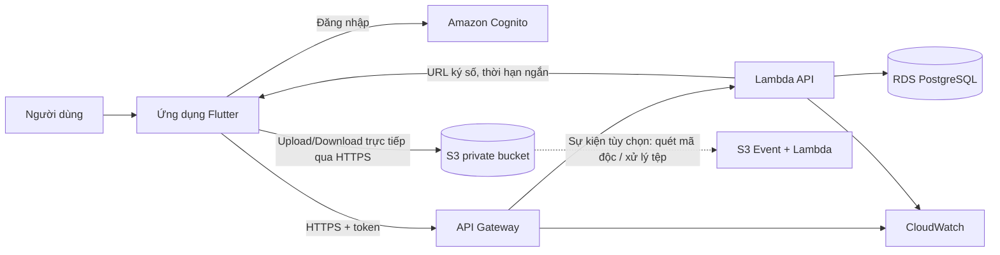

# Phân tích kiến trúc Cloud cho ứng dụng Quản lý tài liệu

## 1. Các thành phần cốt lõi hiện có

| Thành phần | Thực trạng trong dự án | Nhận xét |
|---|---|---|
| **Frontend** | Ứng dụng Flutter, tổ chức theo Presentation, Use Cases, Domain và Data. `DocumentController` quản lý trạng thái; giao diện hỗ trợ CRUD, tìm kiếm, lọc, yêu thích và chọn tệp. | Có nền tảng phù hợp để thay nguồn dữ liệu phía sau mà không phải viết lại toàn bộ giao diện. Đây là ứng dụng client; hiện chưa có luồng đăng nhập hay phân quyền. |
| **Backend/API** | **Chưa có backend hoặc API.** `main.dart` khởi tạo trực tiếp data source và repository trong ứng dụng. | Chưa có dịch vụ trung tâm để xác thực người dùng, áp dụng quyền truy cập hoặc xử lý dữ liệu thống nhất giữa nhiều thiết bị. |
| **Database** | **Chưa có database.** `DocumentLocalDataSourceImpl` giữ tài liệu trong một danh sách trong bộ nhớ và nạp dữ liệu mẫu. | Dữ liệu tạo hoặc sửa không được lưu bền vững sau khi ứng dụng đóng. `toJson`/`fromJson` trong model chỉ hỗ trợ chuyển đổi dữ liệu, không có nghĩa là đã có nơi lưu JSON. |
| **File Storage** | **Chưa có kho lưu nội dung tệp.** Biểu mẫu chọn tệp và yêu cầu bytes, nhưng khi lưu tài liệu chỉ ghi tên hoặc đường dẫn vào `fileUrlOrPath`. | Bytes không được lưu hoặc tải lên; đường dẫn cục bộ không dùng được ổn định trên thiết bị khác hoặc Web. Tài liệu dạng liên kết Web là ngoại lệ vì chỉ lưu URL. |

**Luồng dữ liệu hiện tại:** giao diện Flutter → Controller/Use Cases → Repository → data source in-memory. Dự án chưa cấu hình dịch vụ cloud.

## 2. Điểm nghẽn và hạn chế

### Các hạn chế đã xác nhận trong mã nguồn

- **Mất dữ liệu khi khởi động lại:** data source lưu trong RAM và nạp dữ liệu mẫu, không có lưu trữ bền vững.
- **Tệp đính kèm chưa được lưu:** ứng dụng mới ghi nhận tên hoặc đường dẫn; không đảm bảo tải lại hay mở được tệp đã chọn.
- **Không đồng bộ giữa thiết bị:** chưa có API, database dùng chung hoặc danh tính người dùng.
- **Lọc và tìm kiếm phía client:** repository lấy toàn bộ tài liệu rồi lọc; cách này không phù hợp khi lượng dữ liệu tăng đáng kể.
- **Thiếu năng lực vận hành:** chưa có xác thực, phân quyền, sao lưu, nhật ký tập trung hoặc giám sát dịch vụ.

### Hạn chế có thể gặp trên hạ tầng truyền thống

Chưa có bằng chứng dự án hiện chạy trên máy chủ truyền thống. Nếu triển khai theo mô hình máy chủ đơn, database và ổ đĩa cục bộ, các rủi ro thường gặp gồm:

- Phải tự vận hành, vá lỗi và mở rộng máy chủ.
- Máy chủ hoặc ổ đĩa đơn lẻ có thể trở thành điểm lỗi.
- Sao lưu và phục hồi dữ liệu cần được tự thiết kế, kiểm tra và vận hành.
- Dung lượng tệp tăng có thể đòi hỏi đầu tư hạ tầng trước khi sử dụng hết công suất.

Đây là các rủi ro của mô hình giả định, không phải sự cố đã quan sát ở hệ thống hiện tại.

## 3. Mô hình Cloud và dịch vụ đề xuất

### Mô hình đề xuất: Public Cloud trên AWS

Với ứng dụng quản lý tài liệu học tập hiện chưa có yêu cầu tuân thủ hoặc lưu trú dữ liệu đặc biệt được nêu, **Public Cloud** là lựa chọn phù hợp: có thể bắt đầu nhỏ, giảm nhu cầu tự vận hành trung tâm dữ liệu và mở rộng theo nhu cầu. Chưa có lý do rõ ràng để chọn Private Cloud; Hybrid Cloud sẽ làm tăng độ phức tạp khi hiện chưa có hệ thống tại chỗ cần tích hợp.

| Nhu cầu | Dịch vụ AWS đề xuất | Vai trò |
|---|---|---|
| Lưu nội dung tệp | **Amazon S3** | Lưu PDF, Word, TXT trong bucket riêng tư; hỗ trợ mã hóa, versioning và lifecycle policy. |
| API | **Amazon API Gateway + AWS Lambda** | Cung cấp API xác thực quyền, quản lý metadata và cấp quyền upload/download có thời hạn. |
| Database metadata | **Amazon RDS for PostgreSQL** | Lưu tiêu đề, môn học, loại, tags, trạng thái, chủ sở hữu và S3 object key. |
| Định danh | **Amazon Cognito** | Đăng nhập và cung cấp token để API xác thực người dùng. |
| Nhật ký và cảnh báo | **Amazon CloudWatch** | Theo dõi lỗi API, thời gian phản hồi và các chỉ số vận hành. |

Có thể dùng ECS/Fargate thay Lambda nếu sau này cần dịch vụ chạy liên tục hoặc xử lý dài. CloudFront là tùy chọn khi có nhu cầu phân phối tệp với lưu lượng lớn hoặc người dùng ở xa; giai đoạn đầu có thể dùng URL tải xuống có chữ ký, thời hạn ngắn từ S3.

## 4. Sơ đồ kiến trúc tích hợp Cloud và luồng dữ liệu

### Luồng tải tài liệu lên

1. Người dùng đăng nhập; ứng dụng nhận token từ Cognito.
2. Ứng dụng gọi API kèm token để khởi tạo upload. Backend kiểm tra quyền và tạo bản ghi metadata ở trạng thái chờ tải lên.
3. Backend cấp **pre-signed URL** có thời hạn ngắn cho một object key cụ thể. Ứng dụng tải bytes trực tiếp lên S3 qua HTTPS, không chuyển toàn bộ tệp qua API.
4. Ứng dụng báo hoàn tất; backend xác nhận object tồn tại rồi cập nhật trạng thái tài liệu. Nếu cần, S3 Event có thể kích hoạt bước quét mã độc trước khi cho phép tải xuống.

### Luồng tìm kiếm và tải xuống

- Tìm kiếm, lọc, thêm/sửa/xóa metadata thực hiện qua API và PostgreSQL; API chỉ trả metadata mà người dùng được phép xem.
- Khi tải tệp, backend kiểm tra quyền sở hữu hoặc quyền truy cập rồi cấp URL tải xuống có chữ ký ngắn hạn.
- Không lưu URL ký số trong database vì URL sẽ hết hạn; chỉ lưu S3 object key.
- Khi xóa tài liệu, cần cập nhật metadata và xóa object qua tiến trình có kiểm soát để tránh bản ghi và tệp bị lệch trạng thái.

### Tích hợp với kiến trúc ứng dụng hiện tại

Có thể giữ nguyên Presentation và Use Cases, sau đó thay data source/repository trong `main.dart` bằng các triển khai gọi API. Luồng chọn tệp cần chuyển từ lưu tên/đường dẫn sang tải bytes lên dịch vụ. Entity/model nên lưu object key thay cho đường dẫn cục bộ.

## 5. Đánh giá tác động về bảo mật, chi phí và hiệu suất

| Khía cạnh | Lợi ích | Chi phí/rủi ro cần quản lý |
|---|---|---|
| **Bảo mật** | Có thể xác thực người dùng, kiểm tra quyền ở API, giữ bucket riêng tư, giới hạn quyền bằng URL ký số và mã hóa dữ liệu khi truyền cũng như khi lưu. | Không nhúng khóa AWS vào ứng dụng Flutter. Cần cấu hình IAM theo quyền tối thiểu, kiểm tra quyền truy cập từng tài liệu, giới hạn loại/kích thước tệp và cân nhắc quét mã độc. Cấu hình sai bucket hoặc API có thể làm lộ tài liệu. |
| **Chi phí** | Không cần mua trước máy chủ và dung lượng lưu trữ; S3 và Lambda có thể phù hợp với lượng sử dụng thấp hoặc thất thường. | Chi phí phụ thuộc dung lượng, số lượt gọi, lưu lượng tải ra Internet, cấu hình database, backup và log. RDS có thể là phần chi phí cố định đáng kể ở quy mô nhỏ. Cần ước tính theo số người dùng, dung lượng tệp và tần suất truy cập thực tế. |
| **Hiệu suất** | Tải trực tiếp lên/xuống S3 tránh dùng API làm trung chuyển tệp. Database có thể tìm kiếm theo chỉ mục thay vì tải toàn bộ danh sách về client. | Trải nghiệm phụ thuộc kết nối mạng và vị trí vùng cloud. Cần phân trang API, đánh chỉ mục các trường tìm kiếm và cân nhắc cache/CDN nếu số lượt tải tăng. Tích hợp cloud không tự tạo chức năng đồng bộ offline. |

## Kết luận

Ưu tiên trước mắt là bổ sung API, đăng nhập, lưu metadata bền vững và lưu bytes thật trên S3. Đây là các thay đổi nền tảng để xử lý những hạn chế đã xác nhận trong ứng dụng. Các quyết định như vùng triển khai, CDN, quét tệp và cấu hình database nên được chốt theo yêu cầu lưu trú dữ liệu, quy mô người dùng và ngân sách thực tế.
