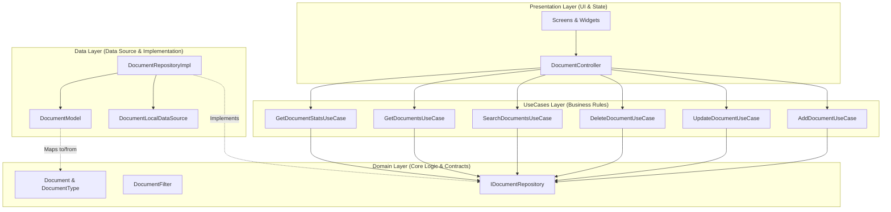
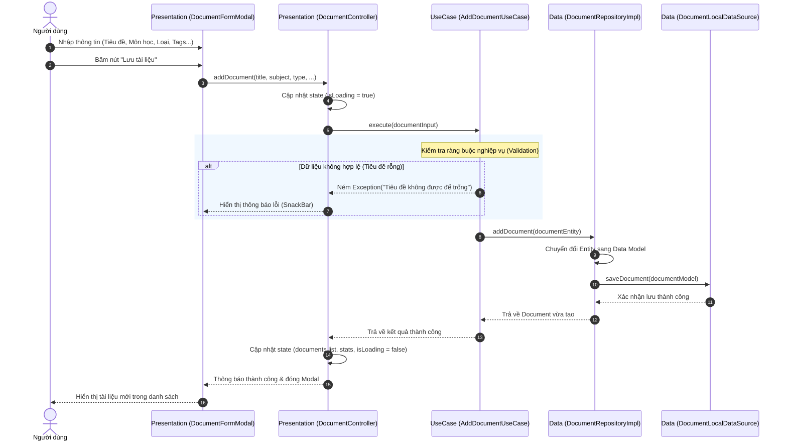
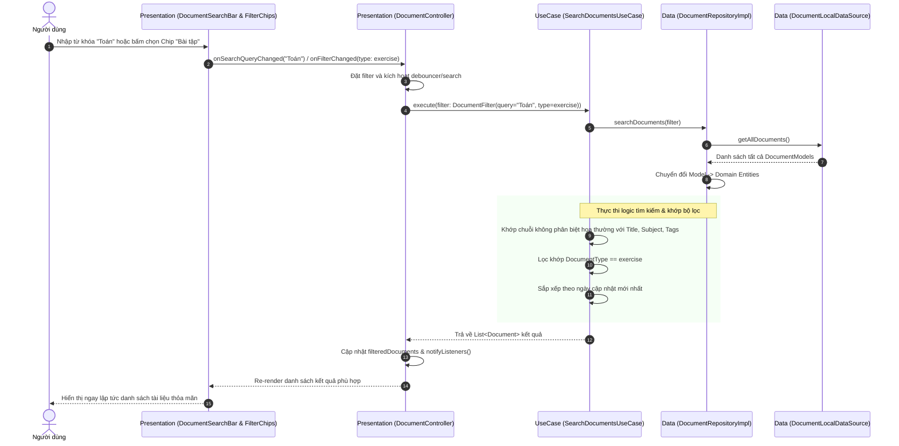
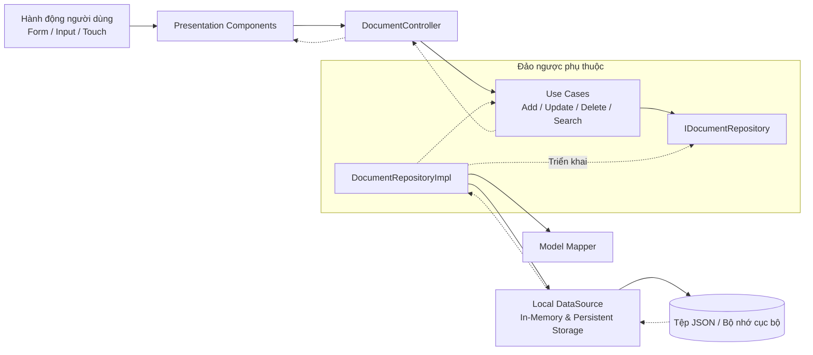

# TÀI LIỆU THIẾT KẾ HỆ THỐNG: ỨNG DỤNG QUẢN LÝ TÀI LIỆU HỌC TẬP
## (Study Document Manager - Cashew Architecture)

---

## 1. TỔNG QUAN HỆ THỐNG & KIẾN TRÚC CASHEW

Dự án **Study Document Manager** được xây dựng dựa trên nguyên lý kiến trúc của ứng dụng mã nguồn mở nổi tiếng **Cashew** (tác giả James Kokoska). 
Trọng tâm kiến trúc gồm:
- **Clean Architecture 4 tầng nghiêm ngặt**: Domain, Data, UseCases (Interactors), Presentation.
- **Dependency Inversion Principle (DIP)**: Tầng Domain hoàn toàn độc lập, không phụ thuộc vào Framework (Flutter) hay Cơ sở dữ liệu.
- **Single Responsibility Use Cases**: Mỗi thao tác nghiệp vụ được đóng gói thành một Interactor độc lập.
- **Reactive State Management**: Quản lý trạng thái hướng sự kiện và phản hồi trực quan.

---

## 2. PHÂN TÍCH USE CASES CHI TIẾT

Hệ thống quản lý 3 loại tài liệu học tập chính:
1. **Bài giảng (Lecture)**: Slide, ghi chú lý thuyết, giáo trình.
2. **Bài tập (Exercise)**: Bài tập thực hành, đề thi, lab.
3. **Tài liệu tham khảo (Reference)**: Sách chuyên khảo, bài báo khoa học, liên kết học liệu.

### 2.1. Use Case 1: Thêm tài liệu mới (Add Document)
- **Actor**: Học viên / Người dùng.
- **Tiền điều kiện**: Ứng dụng đang mở, người dùng chọn hành động "Thêm mới".
- **Dữ liệu đầu vào**:
  - `title` (Tiêu đề - Bắt buộc, không để trống).
  - `subject` (Môn học - Bắt buộc).
  - `type` (Phân loại: `lecture` | `exercise` | `reference`).
  - `description` (Mô tả nội dung).
  - `fileUrlOrPath` (Đường dẫn tệp/liên kết tài liệu).
  - `tags` (Danh sách thẻ từ khóa, e.g., ["flutter", "oop"]).
- **Quy tắc nghiệp vụ (Business Rules)**:
  - Tiêu đề phải có tối thiểu 2 ký tự.
  - Môn học không được để trống.
  - Tự động sinh mã định danh duy nhất (`UUID`).
  - Gán nhãn thời gian khởi tạo (`createdAt`) và cập nhật (`updatedAt`).
- **Hậu điều kiện**: Tài liệu được lưu vào cơ sở dữ liệu/kho lưu trữ cục bộ, danh sách trên UI cập nhật ngay lập tức và số liệu thống kê được tính toán lại.

### 2.2. Use Case 2: Sửa tài liệu (Update Document)
- **Actor**: Học viên.
- **Tiền điều kiện**: Tài liệu cần sửa tồn tại trong hệ thống.
- **Dữ liệu đầu vào**: ID tài liệu cần sửa và các thông tin cập nhật.
- **Quy tắc nghiệp vụ**:
  - Kiểm tra tính tồn tại của tài liệu theo `id`.
  - Cập nhật trường `updatedAt` thành thời điểm sửa đổi hiện tại.
- **Hậu điều kiện**: Thông tin mới được ghi đè và UI hiển thị trạng thái đã cập nhật.

### 2.3. Use Case 3: Xóa tài liệu (Delete Document)
- **Actor**: Học viên.
- **Tiền điều kiện**: Chọn tài liệu cần xóa và xác nhận qua dialog.
- **Quy tắc nghiệp vụ**:
  - Loại bỏ hoàn toàn tài liệu ra khỏi kho lưu trữ theo `id`.
- **Hậu điều kiện**: Tài liệu không còn xuất hiện trong danh sách và thống kê cập nhật.

### 2.4. Use Case 4: Tìm kiếm & Lọc tài liệu (Search & Filter Documents)
- **Actor**: Học viên.
- **Dữ liệu đầu vào (DocumentFilter)**:
  - `searchQuery`: Chuỗi tìm kiếm (áp dụng đa trường: Tiêu đề, Môn học, Thẻ, Mô tả).
  - `type`: Lọc theo phân loại bài giảng, bài tập hoặc tham khảo (hoặc xem tất cả).
  - `subject`: Lọc theo môn học cụ thể.
  - `tag`: Lọc theo thẻ tag cụ thể.
  - `isFavoriteOnly`: Chỉ lọc tài liệu đánh dấu yêu thích.
- **Quy tắc nghiệp vụ**:
  - Tìm kiếm không phân biệt chữ hoa/thường (Case-insensitive).
  - Hỗ trợ tìm kiếm theo token/từ khóa xuất hiện trong Tiêu đề, Môn học hoặc Thẻ tags.
  - Sắp xếp kết quả: Ưu tiên tài liệu mới nhất (`updatedAt` giảm dần).
- **Hậu điều kiện**: Trả về tập danh sách tài liệu thỏa mãn đầy đủ các tiêu chí lọc.

---

## 3. SƠ ĐỒ TUẦN TỰ (SEQUENCE DIAGRAMS)

### 3.1. Sơ đồ tuần tự: Thêm tài liệu mới (Add Document Flow)

---

### 3.2. Sơ đồ tuần tự: Tìm kiếm & Lọc tài liệu (Search & Filter Flow)

---

## 4. SƠ ĐỒ LUỒNG DỮ LIỆU TỔNG THỂ (DATA FLOW DIAGRAM)

---

## 5. THIẾT KẾ MÔ HÌNH THỰC THỂ (DOMAIN ENTITY MODEL)

| Thuộc tính | Kiểu dữ liệu | Ý nghĩa |
| :--- | :--- | :--- |
| `id` | `String` | Khóa chính (UUID duy nhất) |
| `title` | `String` | Tiêu đề tài liệu |
| `subject` | `String` | Tên môn học (e.g. Giải tích, Lập trình di động) |
| `type` | `DocumentType` | Phân loại: `lecture` \| `exercise` \| `reference` |
| `description` | `String` | Ghi chú tóm tắt nội dung tài liệu |
| `fileUrlOrPath`| `String` | Đường dẫn tệp nội bộ hoặc liên kết web |
| `tags` | `List<String>` | Thẻ phân loại nhanh |
| `isFavorite` | `bool` | Đánh dấu yêu thích |
| `createdAt` | `DateTime` | Thời gian khởi tạo |
| `updatedAt` | `DateTime` | Thời gian chỉnh sửa gần nhất |
